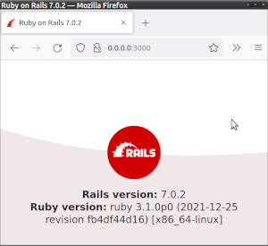

# README


[](https://github.com/drhuffman12/example_dockerized_RoR_app_challenge/releases)

## Development

For Ruby on Rails documentation, see:
* https://rubyonrails.org/
* https://guides.rubyonrails.org/

NOTE: Instructions are assuming that you're running this on Linux and have Docker Compose installed.

### Running locally in the docker container

* (Optionally) in one terminal, run: `docker-compose build`
* In one terminal, run: `docker-compose up`
  * NOTE: After composing up, if you need to re-build the docker image, you'll need to adjust permissions via:
    `bin/tmp_db_permissions` (require sudo; can also be run from w/in the container).
* In another terminal, run:
  * `docker-compose run app bash`
  * Then, run your desired command there.
* In the docker console, reset the database by running:
  * `bundle exec rails db:reset`
  * Or separately:
    * `bundle exec rails db:create`
    * `bundle exec rails db:migrate`
    * `bundle exec rails db:seed`

  * If you get stuck with the docker builds and need a clean start,
    * run `bin/cleanup_after_docker`
    * Enter your password for sudo.
    * Re-run from step `docker-compose build`, optionally with ` --no-cache`.

* To run the tests (in a docker console), run `bundle exec rspec`

* To view the web page, browse to: [http://0.0.0.0:3000/](http://0.0.0.0:3000/).
  * For an initial RoR app, this will look like:
    

### App version

When updating the app version, do so in [config/initializers/version.rb](config/initializers/version.rb).

You can programmatically access the app version via `Myapp::Application::VERSION`, e.g.:

```
ror_app_user@e87003c69e72:/myapp$ rails c
Loading development environment (Rails 7.0.2)
irb(main):001:0> Myapp::Application::VERSION
=> "0.1.0"
```

## TODO: Remove/replace below default info...

This README would normally document whatever steps are necessary to get the
application up and running.

Things you may want to cover:

* Ruby version

* System dependencies

* Configuration

* Database creation

* Database initialization

* How to run the test suite

* Services (job queues, cache servers, search engines, etc.)

* Deployment instructions

* ...
